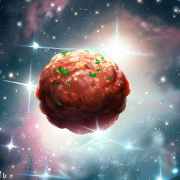

 
# Polpetta
[](https://github.com/mcatta/polpetta/actions/workflows/test.yml)
[](https://search.maven.org/artifact/dev.mcatta/polpetta)

It's "another" MVI library but with a funny name.
With this library you will be able to mutate your State by using a Action defined by using DSL.

## Setup
```groovy
repositories {
  mavenCentral()
}
dependencies {
  implementation 'dev.mcatta:polpetta:0.0.3'
}
```

## How it works
You application's State must extend `State` and your action the `Action` class. Every `Action` can prompt a `Reducer` which basically manipulate your State.

```kotlin
sealed interface CounterState : State {
    data class Count(val counter: Int) : TestState
    data class Result(val message: String) : TestState
}

sealed interface CounterAction : Action {
    object Increase : CounterAction
    object Decrease : CounterAction
    data class Set(val n: Int) : CounterAction
    object DoNothing : CounterAction
    object ToString : CounterAction
}

interface MySideEffect : SideEffect
```

This is you State and Actions definition, now you need to write a `StateStore` which basically will persist your state and your `Action/Reducer` definition.

```kotlin
class CounterStore(scope: CoroutineScope) : StateStore<CounterAction, CounterState, MySideEffect>(
    coroutineScope = scope,
    initialState = CounterState.Count(0),
    reducerFactory =  {
        on<CounterAction.Decrease> { action, state ->
            state.mutate<CounterState.Count> { copy(counter = counter - 1) }
        }
        on<CounterAction.Increase> { action, state ->
            state.mutate<CounterState.Count> { copy(counter = counter + 1) }
        }
        on<CounterAction.Set> { action, state ->
            state.mutate<CounterState.Count> { copy(counter = action.n) }
        }
        on<CounterAction.DoNothing> { action, state ->
            state.nothing()
        }
        on<CounterAction.ToString> { action, state ->
            state.transform<CounterState.Count, CounterState.Result> { CounterState.Result(counter.toString()) }
        }
        // ...
    }
)
```

## Supported StateModifiers

The reducer supports three types of operations:
```kotlin
{ action, state -> state.nothing() }
```
which basically doesn't change the state

```kotlin
{ action, state -> state.mutate<CounterState.count> { copy(counter = counter + 1) } }
```
which mutate the properties of the current state (Note: your state must be `data class` in order to copy it)

```kotlin
{ action, state -> state.transform<CounterState.count, CounterState.result> { CounterState.Result(counter.toString()) } }
```
which allows to change the current state into a new one of different type

## Side Effects
Polpetta supports also side effects. In order to support that we need to specify which `SideEffect` class we want to use:
```kotlin
class CounterStore(scope: CoroutineScope) : StateStore<CounterAction, CounterState, MySideEffect>
```
otherwise we can say `Nothing`
```kotlin
class CounterStore(scope: CoroutineScope) : StateStore<CounterAction, CounterState, Nothing>
```

Then given a specific SideEffect event we can prompt it inside the Reducer's scope, like this:
```kotlin
// Inside the StateStore
on<TestAction.Increase> { _, stateModifier ->
    sideEffect(TestSideEffect.Toast("Show message"))
    
    stateModifier.mutate<TestState.Count> { copy(counter + 1) }
}
// On the View
testStore.sideEffectFlow.collect {}
```

### License
```
Copyright 2023 Marco Cattaneo  
 
Licensed under the Apache License, Version 2.0 (the "License");  
you may not use this file except in compliance with the License.  
You may obtain a copy of the License at  
 
     http://www.apache.org/licenses/LICENSE-2.0  
 
Unless required by applicable law or agreed to in writing, software  
distributed under the License is distributed on an "AS IS" BASIS,  
WITHOUT WARRANTIES OR CONDITIONS OF ANY KIND, either express or implied.  
See the License for the specific language governing permissions and  
limitations under the License.
```
